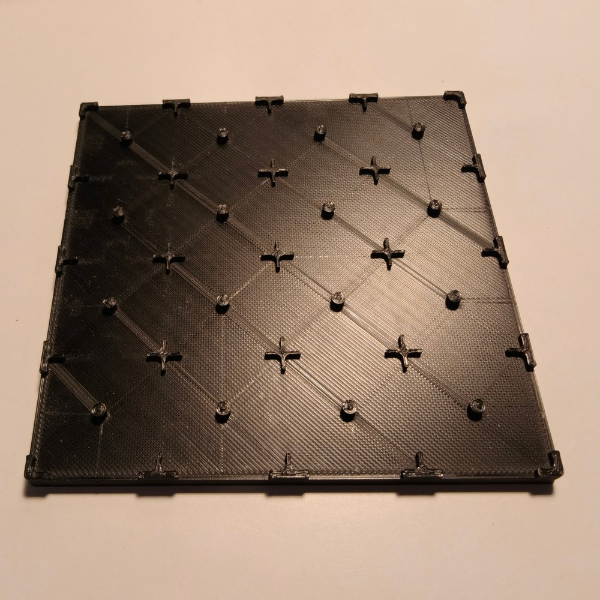
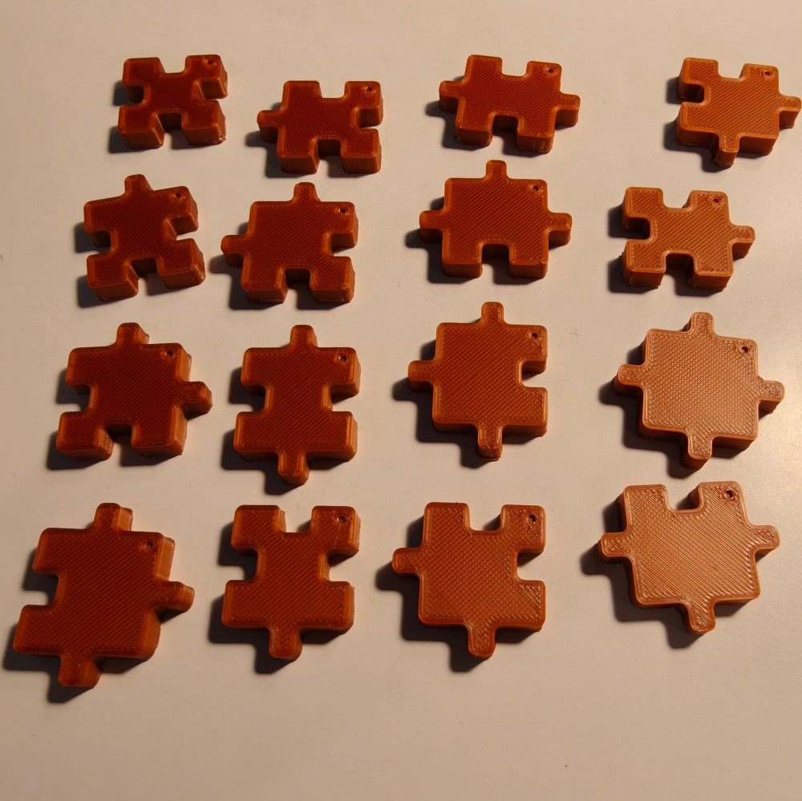
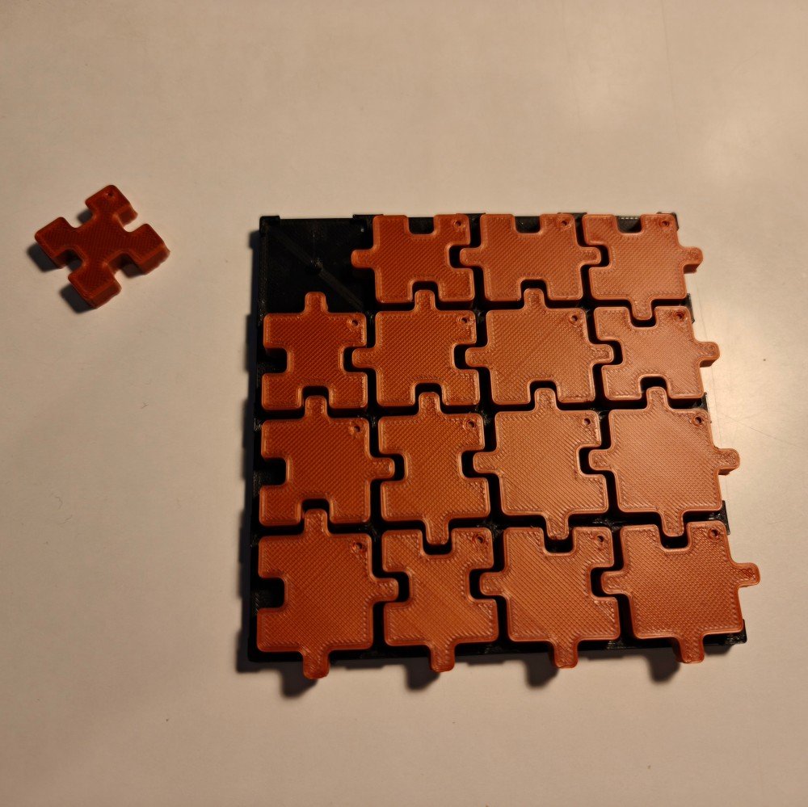
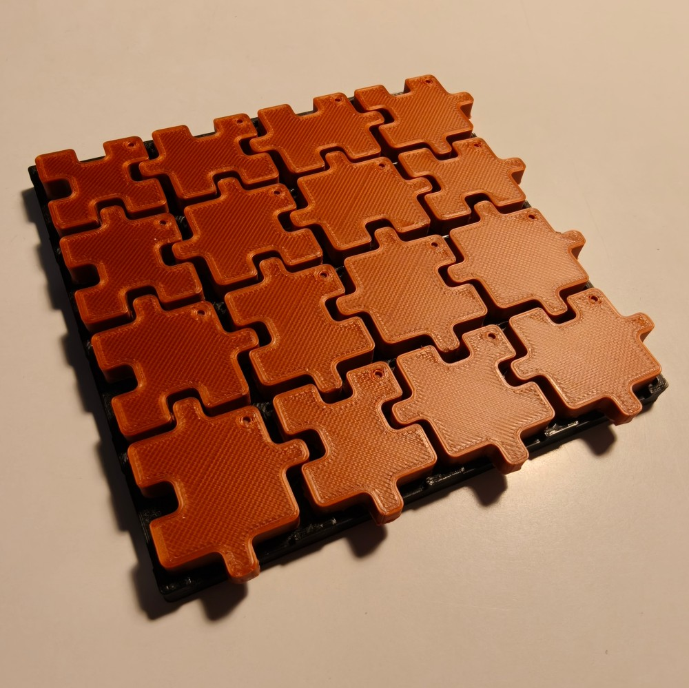

# Walter Puzzle

  

The Walter Puzzle is a tiling puzzle made of **16 jigsaw-like pieces** that must be fitted into a **4 × 4 grid**.
It looks simple, every piece fits with almost every other one, but filling the whole grid without a single mismatch is a real logic challenge.

The puzzle exists in two forms:

- a **physical version**, 3D printable (a base plate and 16 pieces, see `3D Models/`);
- a **web version** (see `Web/`), playable on computer and phone, which can also generate challenges, add optional constraints, solve a grid and count its solutions.

## The 3D printed puzzle

<table>
  <tr>
    <td align="center"> The base plate</td>
    <td align="center"> The 16 pieces</td>
  </tr>
  <tr>
    <td align="center"> One piece left to place</td>
    <td align="center"> A solved grid</td>
  </tr>
</table>

## The pieces

Each piece is a square with four sides: top, right, bottom and left.
Each side is either a **tab** (it sticks out) or a **hole** (it goes in).

With two possible shapes on four sides, there are 24 = **16 possible pieces**, and the puzzle contains **each of them exactly once**: from the piece with only holes to the piece with only tabs.

<table>
  <tr><td align="center"> 0</td><td align="center"> 1</td><td align="center"> 2</td><td align="center"> 3</td><td align="center"> 4</td><td align="center"> 5</td><td align="center"> 6</td><td align="center"> 7</td></tr>
  <tr><td align="center"> 8</td><td align="center"> 9</td><td align="center"> 10</td><td align="center"> 11</td><td align="center"> 12</td><td align="center"> 13</td><td align="center"> 14</td><td align="center"> 15</td></tr>
</table>

The number of a piece tells which sides have a tab: add **1** for a tab on top, **2** on the right, **4** at the bottom and **8** on the left.
For example, piece 5 = 1 + 4 has tabs on top and at the bottom, and holes on the left and right.

Across the whole set, every side is balanced: 8 pieces have a tab on top and 8 have a hole on top, and the same goes for each of the other sides.

## The rules

1. Place all 16 pieces in the 4 × 4 grid, one piece per cell.
2. **Pieces cannot be rotated.** They all keep the same orientation; on the physical pieces, a small mark in one corner shows which way they go.
3. Two neighbouring pieces must **fit together**: wherever two pieces touch, a tab must face a hole. Two tabs or two holes facing each other are not allowed.
4. The outer border of the grid is free: any side can face the edge of the board.

The puzzle is solved when all 16 pieces are placed and every contact between neighbours is a tab facing a hole.

### Example of a solution

<table>
  <tr><td align="center"></td><td align="center"></td><td align="center"></td><td align="center"></td></tr>
  <tr><td align="center"></td><td align="center"></td><td align="center"></td><td align="center"></td></tr>
  <tr><td align="center"></td><td align="center"></td><td align="center"></td><td align="center"></td></tr>
  <tr><td align="center"></td><td align="center"></td><td align="center"></td><td align="center"></td></tr>
</table>

## Why it is harder than it looks

Placing the first pieces is easy: almost anything fits somewhere.
The difficulty comes at the end. Each piece is unique, so the last few cells each demand one very precise combination of tabs and holes, and the piece with that exact shape may already be used elsewhere.
Solving the puzzle means thinking ahead about which shapes the remaining cells will need.

A useful observation: since every inner contact is made of exactly one tab and one hole, the border of a finished grid always shows exactly **8 tabs and 8 holes**:

- 4 tabs among the 8 sides facing the left and right edges;
- 4 tabs among the 8 sides facing the top and bottom edges.

This comes from the balance of the set: there are 16 left/right tabs in total, and the 12 inner vertical contacts use 12 of them, which leaves 4 for the edges. The same reasoning applies vertically.

## Number of solutions

The solutions were counted with an exhaustive computer search, which tried every possible placement.

| Count | Value |
|---|---|
| Solutions of the free puzzle | **2,765,440** |
| Solutions that are really different (rotating or mirroring the whole grid gives another valid solution, so those are counted once) | **345,762** |
| Possible borders for a finished grid, out of 65,536 combinations | **4,900** |

**Every piece can go in every cell.** Placing a single piece anywhere never makes the puzzle impossible: between 163,248 and 183,096 solutions remain depending on the piece and the cell.

## Variants with constraints

The free puzzle has millions of solutions. To make harder or different challenges, constraints can be added.

### Pre-placed pieces

Start with one or several pieces already placed in given cells, then complete the grid around them.
The more pieces are imposed, the fewer solutions remain, until a grid has a single solution.
This works on the physical puzzle as well as in the web version.

The web version can generate such challenges. It picks a random solution, reveals some of its pieces, and keeps only the pieces needed to reach the chosen difficulty. The given pieces are shown in black and cannot be moved.
The difficulty depends on the number of solutions left by the given pieces: the fewer solutions, the harder the challenge.

| Difficulty | Solutions left | Pieces usually given |
|---|---|---|
| Easy | 200 to 1,000 | 3 to 4 |
| Medium | 20 to 199 | 4 to 5 |
| Hard | 2 to 19 | 5 to 6 |
| Expert | exactly 1 | 5 to 8 |

Surprisingly, a harder challenge does not give many more pieces: as few as 5 well-chosen pieces can be enough to leave a single solution.

### Border constraints (web version only)

In the web version, each of the 16 positions around the grid can optionally receive a constraint:

- **off**: the side facing the edge is free (default);
- **tab coming from the edge**: the piece in that position must have a hole on that side;
- **hole on the edge**: the piece in that position must have a tab on that side.

Because a finished grid always has 4 left/right tabs and 4 top/bottom tabs on its border, a set of border constraints that breaks this rule has no solution.

Border constraints alone are not enough to make a solution unique: even with all 16 positions fixed, a valid border still leaves **between 160 and 1,864 solutions**. To build a puzzle with a single solution, combine them with pre-placed pieces.

## Contents of the repository

- `3D Models/plate.stl`: the base plate (135 × 135 mm), with guides marking the 16 cells.
- `3D Models/pieces.stl`: the 16 pieces, ready to print.
- `Images/pieces.stl.svg`: a flat view of the 16 pieces.
- `Web/`: the web version. Open `Web/index.html` in a browser, choose a difficulty and start a **New challenge**, or play freely. Drag the pieces onto the grid (or tap a piece, then a cell), tap around the grid to add border constraints, and use **Hint**, **Solve**, **Count solutions** and **Save** to explore grids.
